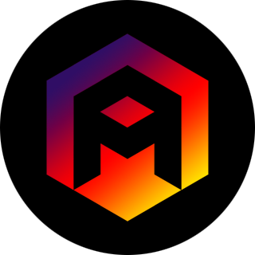

<h1 align="center">Hello 🤗, I'm Abdurrahman</h1>

 

<h3 align="center">A Computer Engineer, Data Scientist, Researcher</h3>

<!--
<h3 align="center"> 
Turkish-German University
</h3>

 

-->

 

 

  
   
   
  <!---->
  

[//]: # (- 🌟 My Favourite Language is **Java**)

- 📚 MSc. Student at **Turkish-German University**
- 🌌 I’m currently learning **Advanced Concepts in Neural Networks & Deep Learning**

 

<h3 align="left">Connect with me:</h3>

-  <a href="https://linkedin.com/in/abdurrahmanodabaşı" target="blank">**@Abdurrahman ODABAŞI**</a>

-     **odabasiabdurrahman@gmail.com**

 

<h3 align="left">Technologies:</h3>

 

 

 
 
 

 

<h3 align="left">Tools:</h3>

 

  
  

 

<h3 align="left">Most Used Languages:</h3>

 

<h3 align="left">My GitHub Stats:</h3>

 

<h3 align="left">My Last Repository:</h3>

